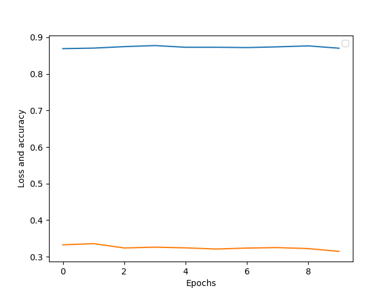

# MachineLearningLearning
Simple examples of code to learn ML methods

This is a project that contains neural network in Keras to provide user with the recognition on FORM of art.

## Databases

The database is provided via [WebGaleryOfArt](https://www.wga.hu/index.html)
Here, we have two modified .xlsx files:
* > catalogMy.xlsx
used to provide learning samples
* > new.xlsx
to provide test samples

All the samples were downloaded from the website so I had to create an algorithm to deconstruct URLs and then download given file with resize.
This is done in _imagehandler.py :+1: Please, note that the images are not greyscale anymore, yet I didn't want to change the name of the function :shipit:

Then, after downloading, mixing in _database.py there is a function > createImageDatabase
that takes the directory and alows to download new images given the dataframe. Note that if image is already present it is not needed to be downloaded again.

## Network

Okay, so as we created the dataframes we take our _network.py file and there build network using VGG19 model from Keras library. Then we add 3 layers and freeze the network so only them can learn.
After that we unfreeze last convolutional layers and owing to that the network provides us with a .h5 file. Reminder - we can change the column of the trained parameters, yet only 65% max has been achieved for the others.
The loss function is categorical crossentropy as in most multi-categories project. Also, a few activation functions have been used, yet, with all probabilistic ones, there's no much gain using one or another. 

The network is trained to predict the type of art, and the types are listed in the .xls files, there are 13 of them. Not all columns can probably predicted accurately as not all informations is provided just by looking at the picture. Probably, multilabel system for other columns would work quite better, one can try to test it, as it is not much work. 

Here we have also the testModel function with flow_from_dataframe predictions. There is a problem with that so:

* [x] CREATE WORKING MODEL WITH GOOD EVALUATION
* [ ] HOW TO IMPLEMENT THE PREDICTIONS, DON'T INVOLVE BATCHES?

All right, so one can see for from_imagenet_FORM_2.h5 file we have FORM_2ACC.png that says that validation accuracy is about 90% - that is quite nice.

